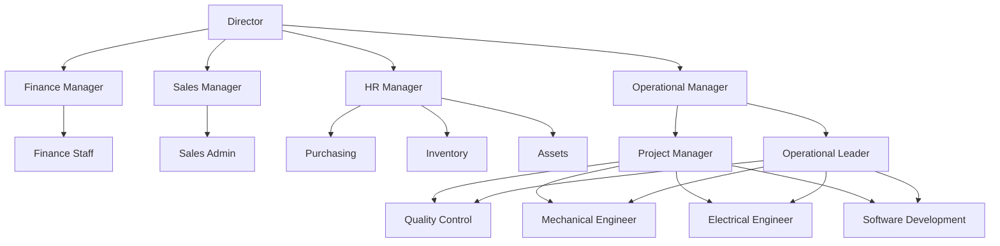

# Struktur Organisasi

## 1. Struktur Utama

```text
Director
├── Finance Manager
│   └── Finance Staff
│
├── Sales Manager
│   └── Sales Admin
│
├── HR Manager
│   ├── Purchasing
│   ├── Inventory
│   └── Assets
│
└── Operational Manager
    ├── Project Manager
    └── Operational Leader
        │
        └── Technical & Quality Team
            ├── Quality Control
            ├── Mechanical Engineer
            ├── Electrical Engineer
            └── Software Development
```

> **Catatan Struktur Operasional:**  
> Project Manager dan Operational Leader berada di bawah Operational Manager.  
> Keduanya memiliki fungsi koordinasi dan pengawasan terhadap seluruh **Technical & Quality Team**, yang terdiri dari:
> - Quality Control
> - Mechanical Engineer
> - Electrical Engineer
> - Software Development

---

## 2. Struktur Operasional

```text
Operational Manager
│
├── Project Manager ───────────────┐
│                                  │
├── Operational Leader ────────────┤
│                                  │
│                                  ▼
│                       Technical & Quality Team
│                       ├── Quality Control
│                       ├── Mechanical Engineer
│                       ├── Electrical Engineer
│                       └── Software Development
```

### Hubungan Kerja

- **Operational Manager**
  - Membawahi Project Manager dan Operational Leader.
  - Bertanggung jawab atas keseluruhan fungsi operasional, project execution, dan technical operation.

- **Project Manager**
  - Mengelola pelaksanaan project.
  - Mengkoordinasikan scope, timeline, resource, deliverable, dan project issue.
  - Membawahi serta mengarahkan Technical & Quality Team dalam konteks pelaksanaan project.

- **Operational Leader**
  - Mengelola aktivitas operasional harian tim teknis.
  - Mengkoordinasikan resource, task execution, technical issue, dan aktivitas lapangan/produksi.
  - Membawahi serta mengarahkan Technical & Quality Team dalam konteks operasional.

- **Technical & Quality Team**
  - Quality Control
  - Mechanical Engineer
  - Electrical Engineer
  - Software Development

---

## 3. Mermaid Diagram



---

## 4. Prinsip Reporting Line

Struktur ini menggunakan pola **dual operational supervision** untuk Technical & Quality Team:

- **Project Manager** berwenang dalam konteks **project execution**.
- **Operational Leader** berwenang dalam konteks **daily operation dan technical execution**.
- **Operational Manager** menjadi escalation point dan pemegang otoritas akhir apabila terjadi konflik prioritas antara kebutuhan project dan kebutuhan operasional.

Dengan struktur ini, Engineer dan Quality Control tidak ditempatkan eksklusif hanya di bawah Project Manager ataupun Operational Leader, tetapi merupakan resource bersama di bawah fungsi Operational Manager.
